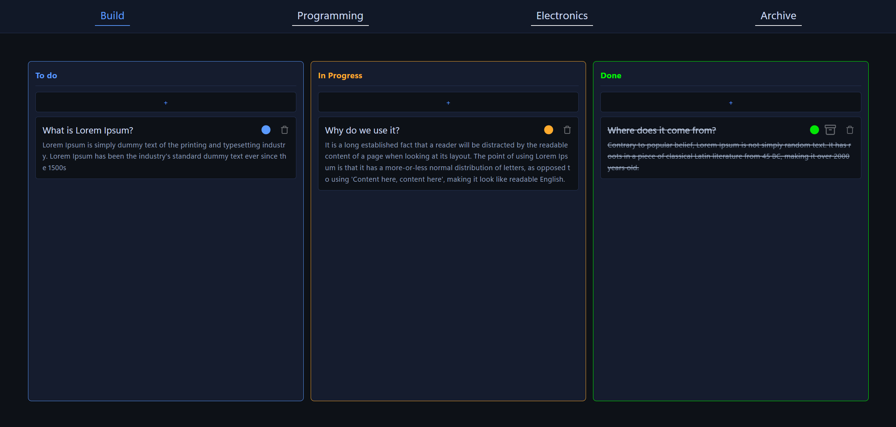

# FRC 5790 Task Board

A kanban-style task board I built for my FRC team to keep track of what needs to get done during build season. Everyone on the team can see and update tasks in real time.



## What it does

- Organize tasks into categories (Build, Programming, Electronics)
- Drag and drop tasks between To Do, In Progress, and Done columns
- Add new tasks with optional descriptions
- Archive completed tasks to keep the board clean
- Restore archived tasks if needed
- Delete tasks you don't need anymore
- Real-time sync across all connected devices using WebSockets

## How to run it

1. Install dependencies:
```
pip install flask flask-socketio
```

2. Start the server:
```
python server.py
```

3. Open `http://localhost:5000` in your browser

The database (`tasks.db`) gets created automatically on first run.

## Customizing categories

You can change the tabs by editing the array in `static/js/ui/navConstructor.js`:

```js
fakearray = ["Build", "Programming", "Electronics"]
```

Add or remove items from the array to create your own categories.

## Tech stack

- Python / Flask backend
- SQLite database
- Socket.IO for real-time updates
- SortableJS for drag and drop
- Vanilla JS frontend
